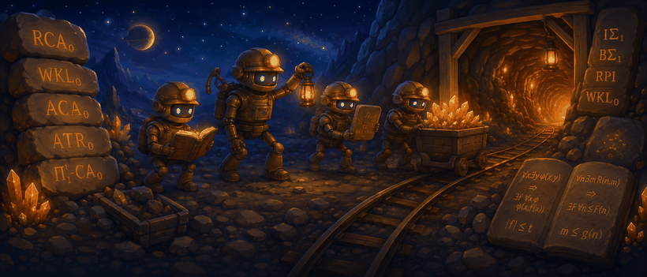

# reverse-mathlib

**A typed, proof-carrying atlas of mathematical strength and proof architecture in Lean.**
It records exact statement variants, presentations, represented uniform problems, and
concrete proof artifacts under several deliberately noncollapsed analyses: ordinary and
strict reverse mathematics, higher-order reverse mathematics, Weihrauch reducibility,
quantitative proof mining, and mathlib-specific proof-route archaeology.

The name has a double meaning: conventional **reverse mathematics** — which principles
suffice or are necessary over a weak base — and **reverse-engineering mathlib** — which
ideas, representations, interfaces, and proof routes are embodied in its declarations. The
project studies not only the weakest principles known to prove a theorem, but which route a
particular proof takes, which stronger ambient resources make a standard or elegant
transformation possible, what the statement's presentation supplies, and what witnesses,
oracle behavior, or quantitative data the proof produces.

> **Today it certifies exactly three ω-model facts — and no all-model or syntactic object-language RCA₀ result.** The
> registry pins `WKLω ⇔ EFILCω` and `EFILCω → Hallω`, each kernel-checked over **every
> Turing ideal**, and the first certified **separation** `RCA₀-core ⊭ω WKL` — a typed
> countermodel certificate witnessed by REC through an explicit bounded-computation Kleene
> tree, a model-class separation and never a turnstile underivability claim. The
> identification of Turing ideals with the ω-models of RCA₀ is literature-backed, with
> object-syntax adequacy pending, and no `RCA₀ ⊢ …` or `RCA₀ ⊬ …` turnstile claim exists
> at any scope (the scoreboard reads ω-model: 3, all-model: 0, syntactic: 0, and scopes
> are never promoted). Alongside these live two further evidence grades, kept
> permanently distinct: **imported checked** Weihrauch reductions (`WKL ≤sW EFILC`,
> `EFILC ≤W WKL` certified-ordinary, `Hall ≤sW EFILC`), proved natively in
> [computable-analysis](https://github.com/cameronfreer/computable-analysis) at pinned
> revisions and ingested as external evidence — never axioms; and **reported** corpus
> findings (what RMZoo, Simpson, and Hirst classify, at pinned snapshots), with missing
> presentation bridges named explicitly. Everything else remains ambient Lean
> factorization: proof-route archaeology, not strength.

**The first program: mining Lean proofs for WKL-shaped compactness routes.**
reverse-mathlib's first mathematical program mines ordinary Lean proofs for WKL-shaped
compactness arguments — not to label theorems WKL-equivalent automatically, but to extract
reusable capabilities whose upper bounds, equivalences, representations, and computational
content are then certified at explicit scopes. The first extracted capability is EFILC
(explicit finite inverse-limit compactness, the boundary found inside mathlib's infinite
Hall proof): certified equivalent to binary-tree WKL at the Turing-ideal ω layer, and
mutually Weihrauch-reducible with it at the represented-problem layer (one direction
strong). Countable Hall is presently a downstream upper-bound consumer of that capability
— not another certified equivalent; its reversal is an audited open question. The REC/WKL
separation is the program's negative control: the route gates prove it touches none of
the EFILC machinery, so the capability is a discovered boundary, not a universal
intermediary. Reversals are sought separately, never inferred from the mined route. This
is the spine of the project's first chapter, not the ontology of the whole atlas.

*Classify the theorem, preserve the proof, and never confuse the two.*

- **[ABOUT.md](ABOUT.md)** — what each layer actually establishes, how it relates to classical
  reverse mathematics, and the assurance routes toward genuine `RCA₀ ⊢ …` results.
- **[Hall–EFILC case study](docs/hall-efilc-case-study.md)** — the checkpointed worked example:
  mining-guided capability extraction across ambient, ω-model, and Weihrauch semantics.
- **[ROADMAP.md](ROADMAP.md)** — Simpson as the vertical theorem spine, RMZoo as the
  horizontal principle graph, the strict-RM and quantitative tracks, and the issue tranches.
- **Live atlas**: <https://cameronfreer.github.io/reverse-mathlib/> — the evidence atlas:
  certified semantic facts, the ambient-factorization graph, imported reductions, corpus
  audits, and the canonical
  [`catalog.direct.json`](https://cameronfreer.github.io/reverse-mathlib/catalog.direct.json).

## What exists today

- **Dependency miner** (`#rm_deps`, `#rm_frontier`, hard `#rm_assert_*` CI gates): exact
  statement/value/proof-only closures over elaborated declarations; raw closures are never
  cut; assertions fail on truncated graphs.
- **The Hall walking slice**: mathlib's infinite Hall theorem mined at its compactness
  boundary and refactored as kernel-checked relative theorems —
  `WeakKonig ⇄ EFILC → CountableHall`, all in unrestricted Lean, composed end-to-end from
  mathlib's order-theoretic Kőnig lemma to `Classical.countableHall_nat`. CI certifies the
  proof-only closures exclude the topological route.
- **A typed catalog**: concepts (`reverse-mathlib:wkl`) ≠ exact statement variants
  (`wkl.binaryTree.ambient`) ≠ Lean interfaces, with registered semantic layers, typed
  external references (`rmzoo:` / `simpson:` / `concordance:` / `sanders:`), direction-aware
  typed certificates, and import-wide collision detection.
- **A quantitative pilot** (`ReverseMathlib/Quantitative/`): Kohlenbach's metastability of
  bounded monotone sequences (Prop. 2.27, Cor. 2.28) with an executable rational realizer and
  its finite-query locality theorem — bounds, not rates; see
  [docs/quantitative-pilot.md](docs/quantitative-pilot.md).
- **A deterministic exporter and site**: canonical JSON extracted from the elaborated
  environment's persistent extension state, rendered to the Pages site on every push.

## External checked evidence: the ω-semantics bridge

[reverse-mathlib-foundation](https://github.com/cameronfreer/reverse-mathlib-foundation)
is an **external checked bridge** between this repository and
[FormalizedFormalLogic/Foundation](https://github.com/FormalizedFormalLogic/Foundation):
a separate workspace pinning exact revisions of both and relating the frozen ω-layer
capabilities here to explicit L₂ sentences evaluated with Foundation's Tarski semantics.
It provides, as kernel-checked theorems with typed export records:

- **one-way context realization** — every Turing ideal satisfies an explicit semantic
  RCA₀ theory on ω-structures (realization evidence only; no converse claim);
- **unconditional exact statement adapters** — closed sentences whose satisfaction, for
  an *arbitrary* second-order part, is exactly the frozen `WeakKonigAt` / `EFILCAt` /
  `CountableHallAt`;
- **checked ω-model countermodels** — the recursive-set structure satisfies the RCA₀
  theory and falsifies the ŴKL and EFILC sentences (via the Kleene tree certified
  here);
- **calculus-relative nonderivability** — a bridge-local Henkin-safe calculus, sound
  over all Henkin structures, in which the RCA₀ theory does not derive the ŴKL
  sentence. Explicitly *not* an unqualified standard-calculus RCA₀ ⊬ WKL: the
  comparison with a pinned standard proof system is recorded as pending.

None of this changes the certified scoreboard here — adequacy evidence upgrades the
interpretation of existing facts, it is not another mathematical leaf — and the bridge
is not yet ingested: ingestion as versioned, pinned JSON evidence is a planned separate
tranche.

## Structure

- `ReverseMathlib/` — mathematical root: `Standard/` principle statements, `Slice/` relative
  proofs, `Classical/` outright instances, `Quantitative/` the Q-track. Sorry-free, standard
  axioms only, `warningAsError` with the mathlib linter set.
- `ReverseMathlib/Registry.lean` — tooling root: `Meta/` (miner, registry, catalog, exporter),
  `Ports/` (catalog seed and port records). Never imported by the mathematical root.
- `ReverseMathlibExperimental/`, `ReverseMathlibFixtures/` — staging and collision-test
  libraries; never imported by production roots.
- `scripts/` — CI gates: sorry boundary and root isolation, axiom audits for both roots,
  miner micro-tests and the hard dependency assertions.
- `tools/zoo/` — the `rmlib-zoo` build/check/serve/diff CLI.

## Building

Pinned to Lean `v4.32.2` and the matching mathlib revision.

```sh
lake exe cache get
lake build
```

Useful commands once built (import `ReverseMathlib.Registry`): `#rm_deps <decl>`,
`#rm_frontier <decl>`, `#rm_concepts`, `#revmath_registry`, `#revmath_port? countableHall`,
`#revmath_stats`.

## License

Apache 2.0; see [LICENSE](LICENSE).

<p align="center">
  
</p>
